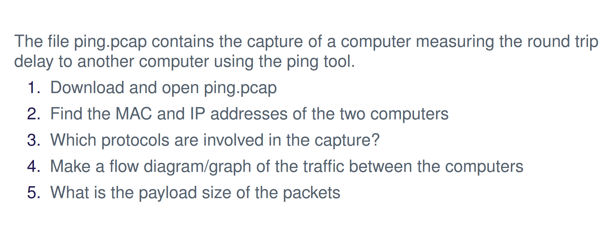
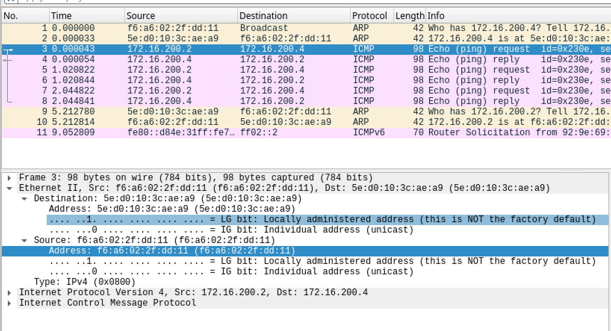

# Exercise 1

# Exercise 2

To find the IP and MAC adresses look here:

The two ip addresses and mac addresses are:

1: 172.16.200.2 / f6:a6:02:2f:dd:11

2: 172.16.200.4 / 5e:d0:10:3c:ae:a9

The protocols involved are:

ARP

ICMP

ICMPv6

# Exercise 3
